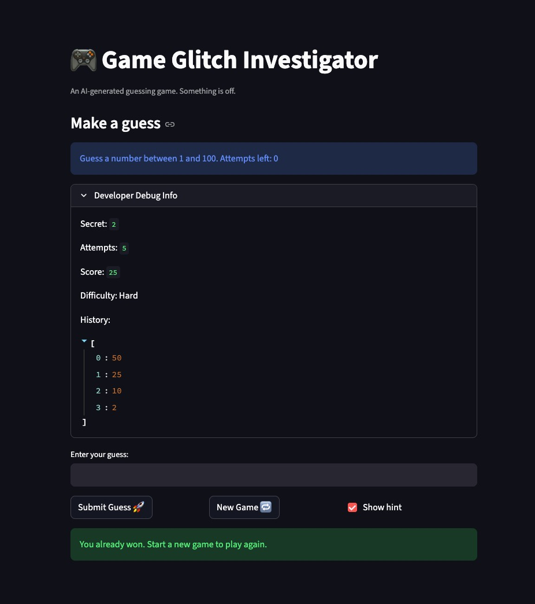

# 🎮 Game Glitch Investigator: The Impossible Guesser

## 🚨 The Situation

You asked an AI to build a simple "Number Guessing Game" using Streamlit.
It wrote the code, ran away, and now the game is unplayable. 

- You can't win.
- The hints lie to you.
- The secret number seems to have commitment issues.

## 🛠️ Setup

1. Install dependencies: `pip install -r requirements.txt`
2. Run the broken app: `python -m streamlit run app.py`

## 🕵️‍♂️ Your Mission

1. **Play the game.** Open the "Developer Debug Info" tab in the app to see the secret number. Try to win.
2. **Find the State Bug.** Why does the secret number change every time you click "Submit"? Ask ChatGPT: *"How do I keep a variable from resetting in Streamlit when I click a button?"*
3. **Fix the Logic.** The hints ("Higher/Lower") are wrong. Fix them.
4. **Refactor & Test.** - Move the logic into `logic_utils.py`.
   - Run `pytest` in your terminal.
   - Keep fixing until all tests pass!

## Document Your Experience

**Game purpose:** A number guessing game where the player tries to guess a randomly chosen secret number within a limited number of attempts. The difficulty setting controls the range and attempt limit. The game gives hints after each guess and tracks a running score.

**Bugs found:**
1. Attempts counter started at 1 instead of 0, so the display showed one fewer attempt than was actually available at the start of every game.
2. The score could go negative. Wrong guesses deducted points with no floor, and the "Too High" branch incorrectly awarded +5 points on even-numbered attempts instead of always deducting.
3. The info message that told the player the valid range was hardcoded to "1 and 100" regardless of the selected difficulty, so Easy (1-20) and Normal (1-50) showed the wrong range.
4. The `logic_utils.py` functions were stubs that raised `NotImplementedError`, so the entire test suite failed before any logic was implemented.

**Fixes applied:**
- Changed `st.session_state.attempts` initialization from `1` to `0`.
- Replaced the inconsistent score branch with a uniform `max(current_score - 5, 0)` for both "Too High" and "Too Low" outcomes.
- Updated the info message to use `{low}` and `{high}` from `get_range_for_difficulty` instead of hardcoded values.
- Implemented `get_range_for_difficulty`, `parse_guess`, `check_guess`, and `update_score` in `logic_utils.py` and updated `app.py` to import from there.
- Fixed test assertions to unpack the `(outcome, message)` tuple returned by `check_guess`.

## Demo

## 🚀 Stretch Features

- [ ] [If you choose to complete Challenge 4, insert a screenshot of your Enhanced Game UI here]
